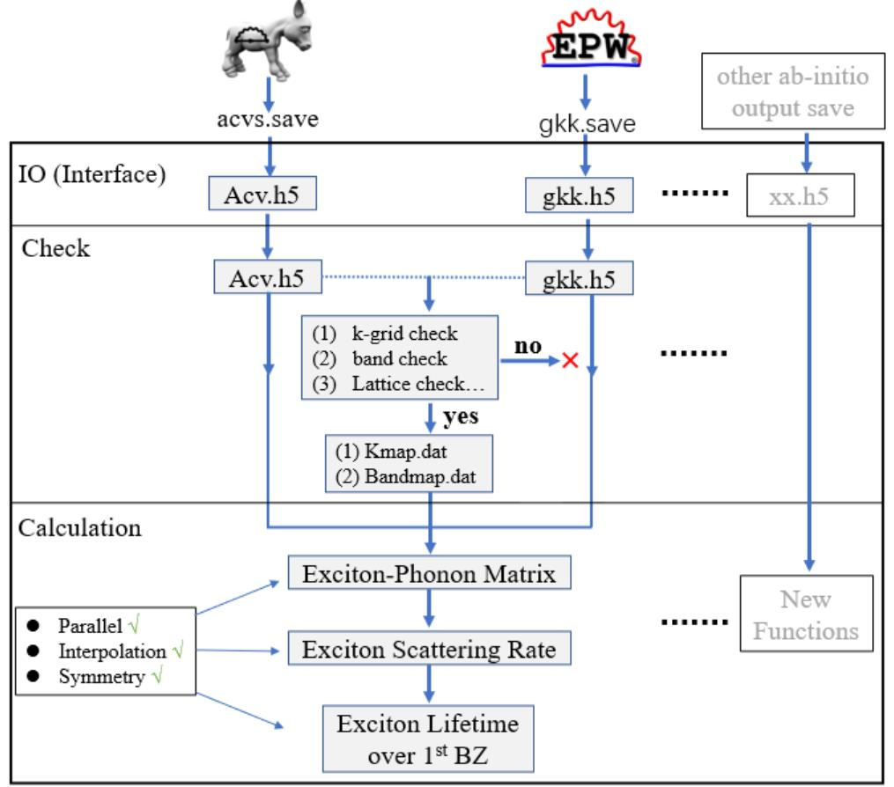
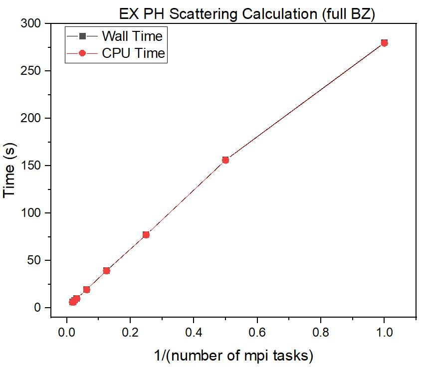

# EXPH

EXPH_v1.4

Author: Bowen Hou

Creating Time: 10/03/2022

Last Updated: 11/06/2022

---
## Exciton-Phonon Interaction

(1) Exciton lifetime (scattring rate) over 1st BZ could be calculated

(2) Exciton-Phonon scattering matrix 

(3) Parallel is available!!

(4) Interpolation is available (parallel is working for interpolation!)

(5) Symmetry is available for finite Q!!

## Workflow

---
## Parallel Efficiency of EX_PH_scat.py (Calculate Scattering Rate of Exciton State over 1st BZ):

(a) Test on PC Windows

| mpi task | wall time (s) | CPU time (s) |
|:--------:|:-------------:|:------------:|
|    1     |    197.743    |   196.203    |
|    2     |    124.767    |   120.906    |
|    4     |    83.884     |    82.344    |
|    6     |    66.071     |    64.609    |
|    8     |    53.952     |    48.594    |

(b) Test on Frontera

| mpi task    | wall time (s)    | CPU time (s) |
| :---: |   :---:       | :---: |
| 1 | 280.088 | 279.437|
|2 | 156.251 | 155.896|
|4 |77.328 | 77.139|
| 8 | 39.579| 39.215|
|16| 19.389 |19.276|
| 32 | 10.068|  9.885|
|40 | 8.068 | 8.057|
|48| 6.130  | 6.119|
|56| 6.382 | 6.148|

---
Todo:

 (i) check everything of EX_PH_scat and EX_PH_lifetime
 
 (ii) normalization has been added, test more about it 
    
    (i) convergence
    (ii) compare it with non-renormalized situation!

 (iii) add some input file and rading system

 (iv) double check this: skip q=0 and omega = 0